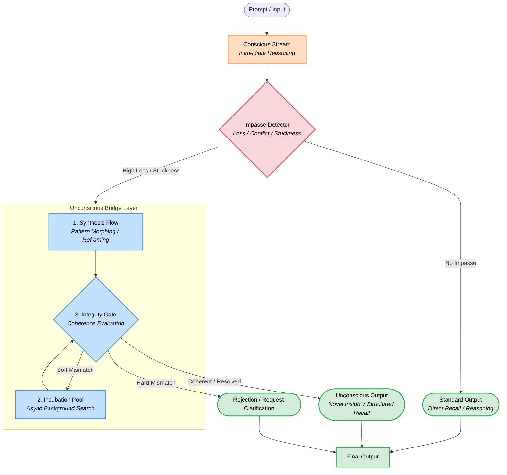

# ACRM Foundational Architecture — Unconscious Bridge Layer

> **Status:** Foundational research architecture / conceptual starting point
>
> **Evidence level:** Conceptual model derived from human–LLM collaborative research; not yet an implemented ACRM runtime capability and not a scientific validation claim.
>
> **Role in ACRM:** This document records the architectural starting point for the research line that treats the unconscious not merely as a memory store, but as a processing bridge activated when the conscious reasoning stream reaches an impasse.

## Foundational proposition

The proposed architecture introduces an **Unconscious Bridge Layer** between immediate conscious reasoning and final output.

The central flow is:

```text
Prompt / Input
      ↓
Conscious Stream
      ↓
Impasse Detector
      ├── No Impasse ─────────────→ Standard Output
      │
      └── High Loss / Stuckness → Unconscious Bridge Layer
                                      ├─ Synthesis Flow
                                      ├─ Incubation Pool
                                      └─ Integrity Gate
                                                ↓
                                   Unconscious Output / Rejection
                                                ↓
                                           Final Output
```

## Original architecture diagram

The following Mermaid diagram is preserved as the foundational artifact from the research interaction that produced this architecture. It is intentionally retained without changing its conceptual topology.



## Component definitions

### 1. Conscious Stream

The immediate reasoning path. It handles ordinary recall and reasoning before the system declares an impasse.

### 2. Impasse Detector

A gating mechanism for detecting conditions such as loss, conflict, or stuckness. In a future executable implementation, these conditions require explicit measurable definitions rather than relying on the conceptual labels alone.

### 3. Synthesis Flow

A reframing and pattern-morphing path intended to transform distributed or retrieved material into candidate structures that may fit the unresolved problem.

### 4. Incubation Pool

An asynchronous background-search space. The diagram permits feedback from the Integrity Gate through a **Soft Mismatch** path, allowing further search rather than immediate rejection.

### 5. Integrity Gate

A coherence-evaluation boundary. It separates candidate structures that appear sufficiently coherent from those that should either return to incubation or be rejected.

### 6. Unconscious Output

A candidate **Novel Insight / Structured Recall** returned from the bridge layer after the integrity gate accepts it.

### 7. Rejection / Request Clarification

A hard-mismatch path preventing an unresolved candidate from being committed as an output.

## Research interpretation

The architectural hypothesis behind this diagram is that an unconscious-like subsystem can be modeled functionally as a **processing bridge** rather than only as a repository of latent content.

A compact formulation is:

```text
Unresolved problem
      ↓
Conscious processing reaches impasse
      ↓
Auxiliary processing channel activates
      ↓
Synthesis + incubation + integrity evaluation
      ↓
Candidate structure returns to conscious/output path
```

The terms **unconscious**, **frequency**, **connection**, and related human analogies are research concepts in this architecture. They must not be treated as established biological mechanisms merely because they appear in the model.

## Implementation boundary

This document is a conceptual starting point. It does **not** imply that ACRM currently implements:

- an autonomous unconscious process;
- asynchronous background reasoning;
- a scientifically established consciousness signal;
- a biological equivalent of human unconscious processing;
- or a validated AGI architecture.

Promotion from this document into executable ACRM components should follow the repository's evidence progression:

```text
Concept
  ↓
Formal specification
  ↓
Testable contract
  ↓
Prototype
  ↓
Implementation
  ↓
Software tests
  ↓
Empirical evaluation
```

## Traceability

This artifact originates from a human–LLM collaborative research dialogue in which the human researcher proposed a functional interpretation of the unconscious as a receiver/processing bridge and language models helped formalize that proposal into a system architecture.

The diagram is therefore preserved as **research provenance**, not as independent evidence that the underlying hypothesis is true.

## Roadmap role

This document is the **foundational starting point** for the corresponding ACRM research architecture. The main ACRM v2 roadmap references it as a Stage 0 / foundational architecture so that subsequent implementation and evaluation work can be traced back to the originating model.
